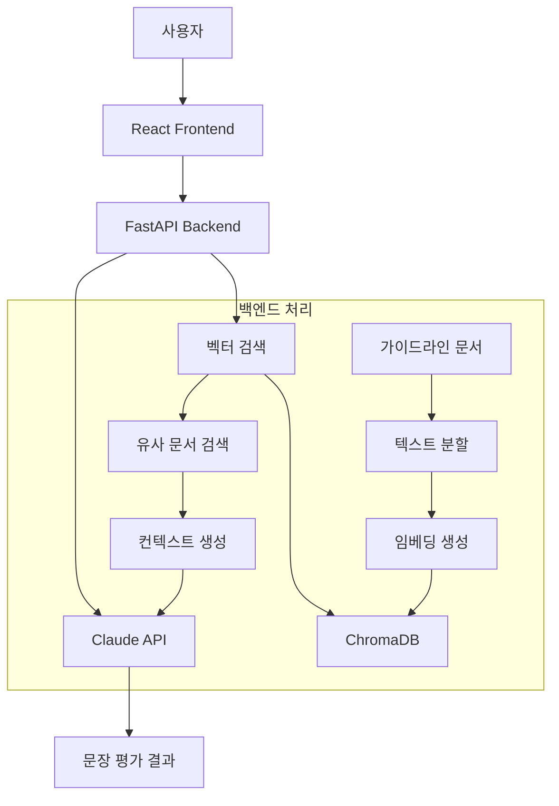

# 🎓 LifeRecordReview - AI 기반 생기부 특기사항 문장 평가 시스템

고등학교 생기부 특기사항 작성을 도와주는 AI 기반 검토 도구입니다. 작성한 특기사항을 입력하면 AI가 문장을 분석하고 개선점을 제안합니다.

## 📋 목차
- [프로젝트 소개](#프로젝트-소개)
- [기술 스택 & 아키텍처](#기술-스택--아키텍처)
- [시스템 요구사항](#시스템-요구사항)
- [설치 및 실행 가이드](#설치-및-실행-가이드)
- [환경 설정](#환경-설정)
- [서비스 동작 흐름](#서비스-동작-흐름)
- [API 명세](#api-명세)
- [문제 해결](#문제-해결)
- [배포 가이드](#배포-가이드)

---

## 🚀 프로젝트 소개

이 시스템은 **고등학교 생기부 특기사항 작성 자동 검토**를 위한 AI 기반 도구입니다.

### 주요 기능
- ✅ **활동 영역별 특기사항 검토** (자율/자치활동, 진로활동)
- ✅ **학업 수준별 맞춤 평가** (상위권, 중위권, 하위권)
- ✅ **AI 기반 3단계 평가**
  - ① 적합성 평가
  - ② 검토 의견 (장점/부족한 점/개선 포인트)
  - ③ 개선 제안 (500자 수정안)
- ✅ **실시간 문장 분석 및 피드백**
- ✅ **벡터 검색 기반 작성요령 매칭**

### 시스템 특징
- 🔥 **GPU 가속 지원** (CUDA + ONNX Runtime)
- 🔄 **세션 기반 다중 사용자 지원**
- 📚 **영역별 전문 가이드라인 데이터**
- 🌐 **웹 기반 사용자 친화적 인터페이스**

---

## 🛠️ 기술 스택 & 아키텍처

### Backend
- **Python 3.12**
- **FastAPI** - 고성능 웹 API 프레임워크
- **LangChain** - AI 체인 오케스트레이션
- **Anthropic Claude** - 문장 평가 및 개선안 생성
- **ChromaDB** - 벡터 데이터베이스
- **ONNX Runtime** - GPU 가속 임베딩 모델 추론
- **Transformers** - 한국어 임베딩 모델 (KoSimCSE 기반)

### Frontend
- **React 18** + **TypeScript**
- **Chakra UI** - 모던 UI 컴포넌트 라이브러리
- **React Icons** - 아이콘 라이브러리

### AI & ML
- **KoSimCSE** - 한국어 문장 임베딩 모델
- **Vector Similarity Search** - RAG 기반 유사 문서 검색
- **GPU 최적화** - CUDA + ONNX Runtime 활용

---

## 💻 시스템 요구사항

### 필수 소프트웨어
- **Python 3.12** 이상
- **Node.js 18** 이상 + npm
- **Git**
- **NVIDIA GPU** (선택, 성능 향상용)
- **CUDA Toolkit** (GPU 사용 시)

### 하드웨어 권장사양
- **CPU**: 4코어 이상
- **RAM**: 최소 8GB (16GB 권장)
- **저장공간**: 최소 5GB (모델 파일 포함)
- **GPU**: NVIDIA RTX 시리즈 (선택사항, 성능 향상)

### 지원 운영체제
- Windows 10/11
- macOS (Intel/Apple Silicon)
- Linux (Ubuntu 20.04+)

---

## 📦 설치 및 실행 가이드

### 1. 프로젝트 복제
```bash
git clone https://github.com/lifeprofessor/LifeRecordReviewSystem.git
cd LifeRecordReviewSystem
```

### 2. 백엔드 설정 및 실행

#### 2.1 Python 가상환경 생성 (권장)
```bash
cd backend

# Windows
python -m venv venv
venv\Scripts\activate

# macOS/Linux
python3 -m venv venv
source venv/bin/activate
```

#### 2.2 의존성 패키지 설치
```bash
# 기본 패키지 설치 (필수)
pip install -r requirements.txt

# GPU 가속 패키지 설치 (성능 향상용)
pip install -r requirements-gpu.txt

# 개발 환경 패키지 설치 (개발자용)
pip install -r requirements-dev.txt

# 또는 백엔드만 설치하는 경우
pip install -r backend/requirements.txt
```

**패키지 파일 설명:**
- `requirements.txt`: 기본 필수 패키지 (프로덕션용)
- `requirements-gpu.txt`: GPU 가속 패키지 (성능 향상용)
- `requirements-dev.txt`: 개발 도구 패키지 (개발자용)
- `backend/requirements.txt`: 백엔드 전용 패키지

#### 2.3 환경변수 설정
```bash
# .env 파일 생성
echo "ANTHROPIC_API_KEY=your_anthropic_api_key_here" > .env
```

#### 2.4 로컬 모델 준비

시스템에서 사용할 한국어 임베딩 모델을 준비합니다.

##### 📁 모델 폴더 생성
```bash
mkdir backend/model_files
```

##### 🔗 모델 다운로드
1. **Hugging Face 모델 페이지 접속**
   - [BM-K/KoSimCSE-roberta-multitask](https://huggingface.co/BM-K/KoSimCSE-roberta-multitask) 접속

2. **파일 다운로드**
   - 페이지에서 **"Files"** 탭 클릭
   - 다음 파일들을 `backend/model_files/` 폴더에 다운로드:

| 파일명 | 설명 |
|--------|------|
| `config.json` | 모델 설정 파일 |
| `pytorch_model.bin` | 모델 가중치 파일 |
| `tokenizer.json` | 토크나이저 설정 |
| `tokenizer_config.json` | 토크나이저 구성 |
| `vocab.txt` | 어휘 사전 |
| `special_tokens_map.json` | 특수 토큰 매핑 |

##### 📂 폴더 구조 확인
```bash
backend/model_files/
├── config.json
├── pytorch_model.bin
├── tokenizer.json
├── tokenizer_config.json
├── vocab.txt
└── special_tokens_map.json
```

##### 다운로드 확인
```bash
[모델 로드 테스트]
python -c "
from transformers import AutoTokenizer, AutoModel
tokenizer = AutoTokenizer.from_pretrained('./backend/model_files', local_files_only=True)
model = AutoModel.from_pretrained('./backend/model_files', local_files_only=True)
print('✅ 모델 로드 성공!')
"
```

##### ✅ 설치 확인
```bash
python -c "
from transformers import AutoTokenizer, AutoModel
tokenizer = AutoTokenizer.from_pretrained('./backend/model_files', local_files_only=True)
model = AutoModel.from_pretrained('./backend/model_files', local_files_only=True)
print('✅ 모델 로드 성공!')
"
```

#### 2.5 로컬 모델 동작 과정
시스템이 처음 실행될 때 자동으로 한국어 임베딩 모델을 다운로드하고 ONNX로 변환합니다. 
이 과정은 최초 1회만 진행됩니다.

#### 2.6 백엔드 서버 실행
```bash
# 로컬 개발용
uvicorn main:app --host 127.0.0.1 --port 8000 --reload

# 네트워크 접근 허용 (내부망 배포용)
uvicorn main:app --host 0.0.0.0 --port 8000

# GPU 가속 강제 활성화
FORCE_ONNX_MODE=true uvicorn main:app --host 0.0.0.0 --port 8000
```

### 3. 프론트엔드 설정 및 실행

#### 3.1 의존성 설치
```bash
cd frontend
npm install
```

#### 3.2 개발 서버 실행
```bash
npm start
```

브라우저에서 `http://localhost:3000` 접속

---

## ⚙️ 환경 설정

### 필수 환경변수

#### backend/.env
```env
# Anthropic API 키 (필수)
ANTHROPIC_API_KEY=your_anthropic_api_key_here

# ONNX 가속 모드 (선택사항)
FORCE_ONNX_MODE=true

# SSL 설정 (선택사항)
ANTHROPIC_VERIFY_SSL=false
```

### API 키 발급 방법
1. [Anthropic Console](https://console.anthropic.com/) 접속
2. API 키 생성
3. `.env` 파일에 키 입력

### GPU 가속 설정

#### cuDNN 설치 (GPU 가속 필수)

cuDNN은 딥러닝 연산을 GPU에서 가속하는 핵심 라이브러리입니다.

**1. NVIDIA 개발자 계정 생성**
- [NVIDIA Developer](https://developer.nvidia.com/) 접속 후 무료 가입

**2. cuDNN 다운로드**
- [cuDNN 다운로드 페이지](https://developer.nvidia.com/cudnn) 접속
- **CUDA 12.x용 cuDNN 9.x** 선택 및 다운로드

**3. 설치 (Windows)**
```bash
# 다운로드한 압축 파일 압축 해제 후 다음 파일들을 복사:
# bin 폴더의 모든 DLL → C:\Program Files\NVIDIA GPU Computing Toolkit\CUDA\v12.x\bin
# include 폴더의 모든 파일 → C:\Program Files\NVIDIA GPU Computing Toolkit\CUDA\v12.x\include  
# lib 폴더의 모든 파일 → C:\Program Files\NVIDIA GPU Computing Toolkit\CUDA\v12.x\lib\x64
```

**4. 환경변수 설정**
- 시스템 환경변수 Path에 추가: `C:\Program Files\NVIDIA GPU Computing Toolkit\CUDA\v12.x\bin`

**5. 설치 확인**
```bash
# cuDNN 설치 확인
python -c "import ctypes; ctypes.CDLL('cudnn64_9.dll')"

# ONNX Runtime GPU 확인
python -c "import onnxruntime as ort; print('Available providers:', ort.get_available_providers())"
# 출력에 'CUDAExecutionProvider'가 있어야 함
```

```bash
# NVIDIA GPU 드라이버 확인
nvidia-smi

# CUDA 버전 확인
nvcc --version

# ONNX Runtime GPU 설치
pip install onnxruntime-gpu
```

---

## 🔄 서비스 동작 흐름

### 1. 시스템 아키텍처


### 2. 상세 처리 과정

#### 단계 1: 문서 로드 및 벡터화
```
사용자 선택 (영역 + 학업수준)
    ↓
POST /api/load-documents
    ↓
해당 영역 마크다운 파일 로드
    ↓
텍스트 분할 (500자 단위, 50자 겹침)
    ↓
KoSimCSE 모델로 임베딩 생성
    ↓
ChromaDB에 벡터 저장
    ↓
세션 ID 반환
```

#### 단계 2: 문장 검토 및 평가
```
사용자 문장 입력
    ↓
POST /api/review
    ↓
벡터 유사도 검색 (상위 3개)
    ↓
Claude API 프롬프트 구성
    ↓
AI 평가 실행
    ↓
결과 파싱 및 반환
    ↓
웹 UI에 결과 표시
```

### 3. 프론트엔드 컴포넌트 구조

#### App.tsx 주요 기능
- **영역 선택**: 자율/자치활동, 진로활동
- **학업수준 선택**: 상위권, 중위권, 하위권  
- **문서 로드**: 선택된 영역의 가이드라인 로드
- **문장 검토**: 입력된 문장에 대한 AI 평가
- **결과 표시**: 3단계 평가 결과 (적합성/검토의견/개선제안)

#### UI/UX 특징
- **반응형 디자인**: 모바일/태블릿/데스크톱 지원
- **실시간 피드백**: 로딩 상태 및 에러 처리
- **직관적 인터페이스**: 단계별 안내와 명확한 결과 표시

---

## 📡 API 명세

### POST /api/load-documents
문서 로드 및 벡터화

**Request Body:**
```json
{
  "area": "자율/자치활동 특기사항" | "진로활동 특기사항",
  "academic_level": "상위권" | "중위권" | "하위권"
}
```

**Response:**
```json
{
  "status": "success",
  "message": "Documents loaded successfully with ONNX Runtime (GPU)",
  "session_id": "uuid-string",
  "server_info": {
    "active_sessions": 1,
    "processing_time": "2.3s",
    "acceleration": "ONNX Runtime (GPU)",
    "model_type": "로컬 모델"
  }
}
```

### POST /api/review  
문장 검토 및 평가

**Request Body:**
```json
{
  "statement": "검토할 특기사항 문장",
  "session_id": "uuid-string"
}
```

**Response:**
```json
{
  "evaluation": "적합성 평가 결과",
  "feedback": "💡 장점\n👉 구체적인 장점 설명...",
  "suggestion": "개선된 문장 (500자)",
  "suggestion_length": 485
}
```

### GET /api/sessions
활성 세션 목록 조회

### DELETE /api/sessions/{session_id}
특정 세션 삭제

---

## ❗ 문제 해결

### 1. 패키지 설치 문제

**가상환경 확인**
```bash
# 가상환경이 활성화되었는지 확인
# 프롬프트 앞에 (venv) 표시 확인

# pip 업그레이드
pip install --upgrade pip

# 캐시 무시 설치
pip install -r requirements.txt --no-cache-dir
```

**ONNX Runtime 설치 실패**
```bash
# GPU 버전 설치 실패 시 CPU 버전 사용
pip uninstall onnxruntime-gpu
pip install onnxruntime optimum

# 또는 특정 버전 지정
pip install onnxruntime-gpu==1.15.1 optimum[onnxruntime]==1.14.0

# 전체 GPU 패키지 재설치
pip uninstall -r requirements-gpu.txt
pip install onnxruntime optimum  # CPU 버전
```

### 2. 모델 로딩 문제

**로컬 모델 다운로드 실패**
```bash
# 인터넷 연결 확인
ping huggingface.co

# 모델 캐시 디렉토리 권한 확인
ls -la backend/model_files/
ls -la backend/model_cache/

# 수동 디렉토리 생성
mkdir -p backend/model_files
mkdir -p backend/model_cache
mkdir -p backend/onnx_models
```

**GPU 인식 문제**
```bash
# NVIDIA 드라이버 확인
nvidia-smi

# CUDA 설치 확인
python -c "import torch; print(torch.cuda.is_available())"

# ONNX Runtime GPU 확인
python -c "import onnxruntime as ort; print('CUDAExecutionProvider' in ort.get_available_providers())"
```

### 3. API 연결 문제

**Anthropic API 키 오류**
```bash
# .env 파일 존재 확인
ls -la backend/.env

# API 키 테스트
curl -H "x-api-key: your_api_key" https://api.anthropic.com/v1/messages
```

**CORS 에러**
- 백엔드가 올바른 CORS 설정으로 실행되고 있는지 확인
- 프론트엔드에서 올바른 API URL 사용 확인 (`http://localhost:8000`)

### 4. 메모리 부족 문제

**RAM 부족**
```bash
# 배치 크기 줄이기 (main.py 수정)
BATCH_SIZE = 8  # 기본값 16에서 변경

# 동시 요청 수 제한
MAX_CONCURRENT_GPU_REQUESTS = 2
```

**GPU 메모리 부족**
```bash
# CPU 모드로 강제 실행
FORCE_ONNX_MODE=false uvicorn main:app --host 0.0.0.0 --port 8000
```

---

## 🚀 배포 가이드

### 로컬 네트워크 배포 (학교/기관 내부망)

#### 1. 백엔드 배포
```bash
cd backend
# 모든 네트워크 인터페이스에서 접근 허용
uvicorn main:app --host 0.0.0.0 --port 8000
```

#### 2. 프론트엔드 빌드 및 배포
```bash
cd frontend
# 프로덕션 빌드
npm run build

# 정적 서버 설치 및 실행
npm install -g serve
serve -s build -l 3000
```

#### 3. 네트워크 접근
- **백엔드**: `http://서버IP:8000`
- **프론트엔드**: `http://서버IP:3000`
- **API 문서**: `http://서버IP:8000/docs`

### 자동 실행 스크립트

#### Windows (start_system.bat)
```batch
@echo off
echo Starting LifeRecordReview System...

cd backend
start cmd /k "venv\Scripts\activate && uvicorn main:app --host 0.0.0.0 --port 8000"

cd ..\frontend
start cmd /k "serve -s build -l 3000"

echo System started!
echo Backend: http://localhost:8000
echo Frontend: http://localhost:3000
pause
```

#### Linux/macOS (start_system.sh)
```bash
#!/bin/bash
echo "Starting LifeRecordReview System..."

# 백엔드 실행
cd backend
source venv/bin/activate
uvicorn main:app --host 0.0.0.0 --port 8000 &

# 프론트엔드 실행
cd ../frontend
serve -s build -l 3000 &

echo "System started!"
echo "Backend: http://localhost:8000"
echo "Frontend: http://localhost:3000"

wait
```

---

## 📊 성능 최적화

### GPU 가속 활용
- **ONNX Runtime + CUDA**: 최대 5-10배 성능 향상
- **배치 처리**: 동시 다중 요청 처리
- **모델 캐싱**: 메모리 효율적 모델 관리

### 시스템 모니터링
```python
# GPU 사용률 확인
import pynvml
pynvml.nvmlInit()
handle = pynvml.nvmlDeviceGetHandleByIndex(0)
info = pynvml.nvmlDeviceGetMemoryInfo(handle)
print(f"GPU Memory: {info.used/1024**3:.1f}GB / {info.total/1024**3:.1f}GB")
```

---

## 🔧 개발자 정보

### 프로젝트 구조
```
LifeRecordReviewSystem/
├── backend/                    # FastAPI 백엔드
│   ├── main.py                # 메인 서버 파일
│   ├── requirements.txt       # 백엔드 전용 의존성
│   ├── data/                  # 가이드라인 데이터
│   │   ├── career_activity_guidelines/     # 진로활동 (13개 파일)
│   │   └── self_governance_guidelines/     # 자율/자치활동 (10개 파일)
│   ├── model_files/           # 로컬 임베딩 모델
│   ├── model_cache/           # 모델 캐시
│   ├── onnx_models/           # ONNX 변환 모델
│   └── chroma_db/            # 벡터 데이터베이스
├── frontend/                  # React 프론트엔드
│   ├── src/
│   │   ├── App.tsx           # 메인 컴포넌트
│   │   └── index.tsx         # 진입점
│   ├── package.json          # Node.js 의존성
│   └── public/               # 정적 파일
├── requirements.txt          # 기본 Python 의존성 (필수)
├── requirements-gpu.txt      # GPU 가속 패키지 (선택)
├── requirements-dev.txt      # 개발 도구 패키지 (개발자용)
└── README.md                # 프로젝트 문서
```

### 주요 데이터 파일
- **자율/자치활동**: 10개 마크다운 가이드라인
- **진로활동**: 13개 마크다운 가이드라인
- **총 23개 전문 작성요령 문서** (약 150KB)

---

## 📄 라이선스

이 프로젝트는 **MIT 라이선스**를 따릅니다.

---

## 🙋‍♂️ 지원 및 문의

문제 발생 시 다음 정보를 포함하여 이슈를 등록해주세요:

1. **운영체제 및 버전**
2. **Python 버전**
3. **GPU 사용 여부**
4. **에러 메시지 전문**
5. **재현 방법**

---

**🎯 이 시스템으로 더 나은 생기부 특기사항을 작성하세요!**
